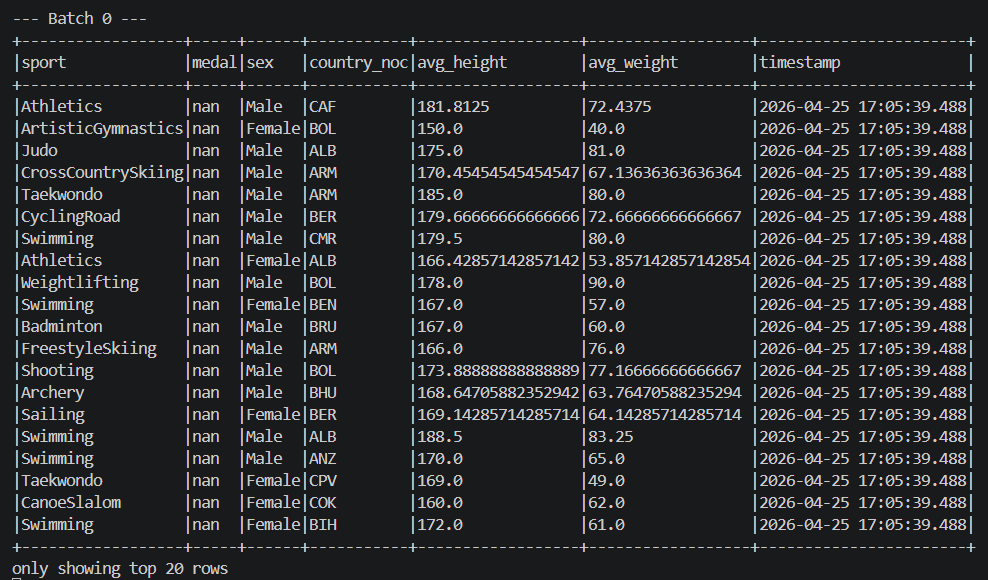
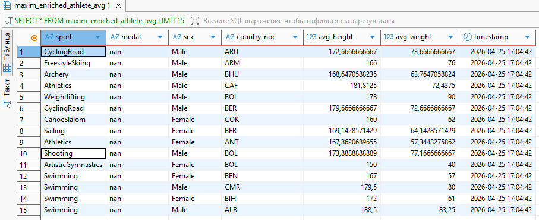
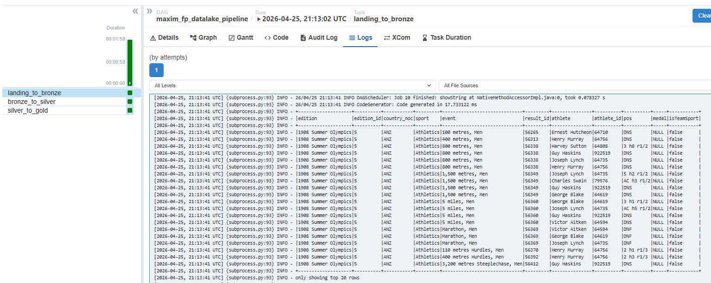
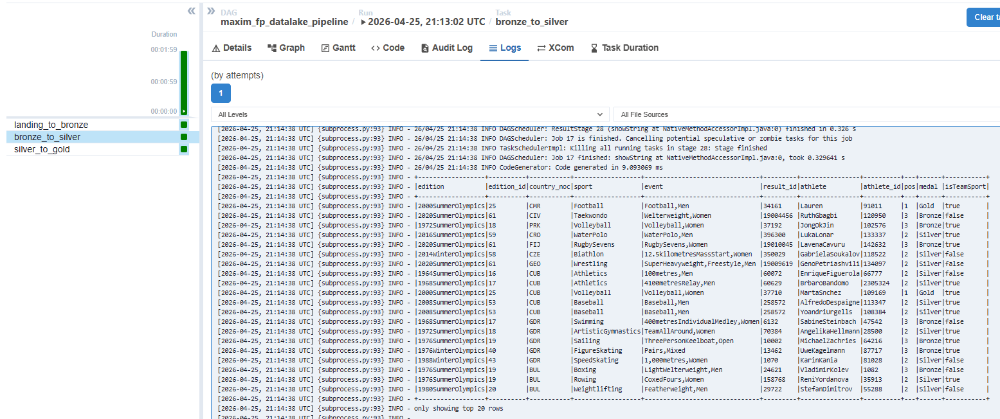
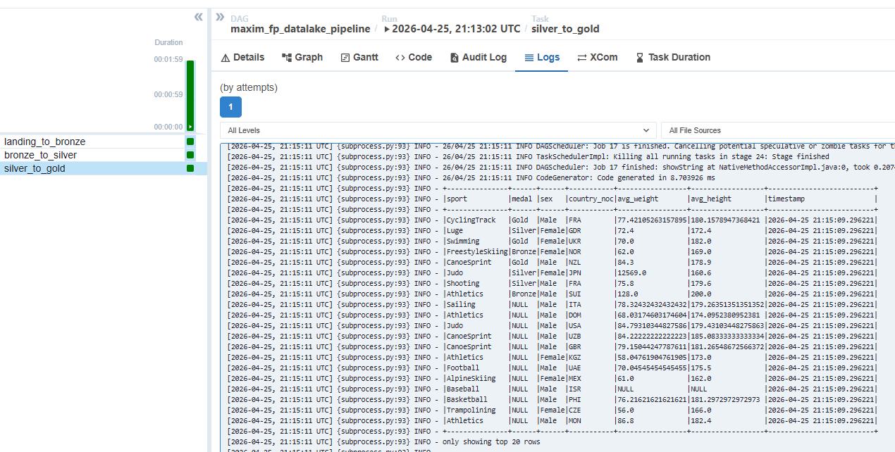
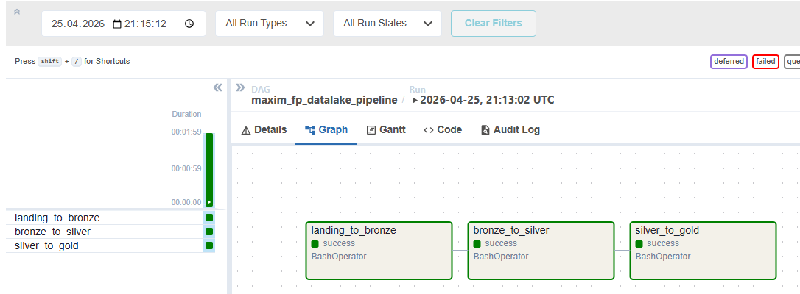

# Фінальний проєкт: Data Engineering

Репозиторій містить реалізацію фінального проєкту з курсу Data Engineering, що складається з двох незалежних частин.

---

## Структура проєкту

```
goit-de-fp/
├── part_1/                          # Частина 1 — Streaming Pipeline
│   ├── streaming_pipeline.py        # Єдиний скрипт стрімінгового пайплайну
│   └── mysql-connector-j-8.0.32.jar # JDBC драйвер MySQL
│
├── part_2/                          # Частина 2 — Batch Data Lake
│   ├── maxim_landing_to_bronze.py   # Крок 1: FTP → CSV → Parquet (bronze)
│   ├── maxim_bronze_to_silver.py    # Крок 2: очищення тексту + дедублікація (silver)
│   ├── maxim_silver_to_gold.py      # Крок 3: join + агрегація (gold)
│   └── maxim_project_solution.py    # Крок 4: Airflow DAG
│
└── README.md
```

---

## Частина 1. Building an End-to-End Streaming Pipeline

### Опис

Реалізація потокового пайплайну для букмекерської контори.\
Фізичні дані атлетів (`athlete_bio`) зберігаються у MySQL, а результати змагань надходять через Kafka-топік.\
Скрипт виконує збагачення та агрегацію в реальному часі й записує результати одночасно у Kafka-топік та MySQL.

Пайплайн складається з 6 послідовних етапів:

1. **Етап 1.** Зчитування `athlete_bio` з MySQL через JDBC.
2. **Етап 2.** Фільтрація рядків, де `height` або `weight` порожні чи не є числами.
3. **Етап 3.** Зчитування `athlete_event_results` з MySQL, batch-запис у Kafka-топік `maxim_athlete_event_results`, потім readStream з Kafka та парсинг JSON.
4. **Етап 4.** Join streaming events з bio за ключем `athlete_id`.
5. **Етап 5.** Агрегація `avg(height)`, `avg(weight)` для кожної комбінації `sport`, `medal`, `sex`, `country_noc` + додавання `timestamp`.
6. **Етап 6.** `forEachBatch` для запису в:
   - а) вихідний Kafka-топік `maxim_enriched_athlete_avg`;
   - б) MySQL таблицю `maxim_enriched_athlete_avg`.

### Конфігурація

```env
# MySQL (JDBC)
MYSQL_HOST=217.61.57.46
MYSQL_PORT=3306
MYSQL_DB=olympic_dataset
MYSQL_USER=neo_data_admin
MYSQL_PASSWORD=your_password

# Kafka
KAFKA_SERVER=77.81.230.104:9092
KAFKA_SECURITY_PROTOCOL=SASL_PLAINTEXT
KAFKA_SASL_MECHANISM=PLAIN
KAFKA_USER=admin
KAFKA_PASSWORD=your_password

# Kafka Topics
TOPIC_INPUT=maxim_athlete_event_results
TOPIC_OUTPUT=maxim_enriched_athlete_avg

# MySQL Output Table
OUTPUT_TABLE=maxim_enriched_athlete_avg
```


### Запуск

Скрипт запускається через `spark-submit`:

```bash
spark-submit \
  --packages org.apache.spark:spark-sql-kafka-0-10_2.13:4.1.1 \
  --jars part_1/mysql-connector-j-8.0.32.jar \
  part_1/streaming_pipeline.py
```

Або напряму через Python (за наявності PySpark у середовищі):

```bash
python part_1/streaming_pipeline.py
```

### Результати виконання

**Вивід батчів у консоль Spark:**


**Збережені дані у БД MySQL:**


---

## Частина 2. Building an End-to-End Batch Data Lake

### Опис

Реалізація multi-hop Data Lake із трирівневою архітектурою обробки даних (landing → bronze → silver → gold) та оркестрацією через Apache Airflow.

Дані — це таблиці `athlete_bio` та `athlete_event_results` з FTP-сервера.

### Файли

- **`maxim_landing_to_bronze.py`** — завантажує CSV з FTP-сервера (`https://ftp.goit.study/neoversity/`), читає через Spark і зберігає у форматі Parquet у `bronze/{table}`.
- **`maxim_bronze_to_silver.py`** — зчитує Parquet з `bronze/`, очищає текстові колонки за допомогою `regexp_replace` (видаляє всі символи крім `a-zA-Z0-9,.\"'`), виконує дедублікацію рядків і записує у `silver/{table}`.
- **`maxim_silver_to_gold.py`** — зчитує `silver/athlete_bio` та `silver/athlete_event_results`, виконує join за `athlete_id`, приводить `weight` і `height` до числового типу, обчислює `avg(weight)` та `avg(height)` для кожної комбінації `sport`, `medal`, `sex`, `country_noc`, додає колонку `timestamp` і записує у `gold/avg_stats`.
- **`project_solution.py`** — Airflow DAG `maxim_fp_datalake_pipeline`, що послідовно запускає три Spark jobs через `SparkSubmitOperator`.

### Локальний запуск

Скрипти запускаються послідовно:

```bash
# Крок 1: Landing → Bronze
python part_2/maxim_landing_to_bronze.py

# Крок 2: Bronze → Silver
python part_2/maxim_bronze_to_silver.py

# Крок 3: Silver → Gold
python part_2/maxim_silver_to_gold.py
```

> Для запуску на Windows необхідно встановити змінні середовища `HADOOP_HOME` та `PYSPARK_PYTHON`:
>
> ```powershell
> $env:HADOOP_HOME = "D:\hadoop"
> $env:PATH = "$env:HADOOP_HOME\bin;$env:PATH"
> $env:PYSPARK_PYTHON = (Get-Command python).Source
> $env:PYSPARK_DRIVER_PYTHON = $env:PYSPARK_PYTHON
> ```

### Запуск через Airflow

1. Скопіюйте всю директорію `part_2` (разом з усіма скриптами) у папку `dags/` вашого Airflow (наприклад, як `dags/part_2/`).
2. DAG `maxim_fp_datalake_pipeline` автоматично з'явиться в Airflow UI. Шляхи до скриптів визначатимуться динамічно.
3. Запустіть DAG вручну (Trigger DAG).

Структура DAG:

```
landing_to_bronze → bronze_to_silver → silver_to_gold
```

### Результати виконання
**Bronze (parquet write / landing → bronze):**


**Silver (cleaning + deduplication):**


**Gold (aggregates avg_weight / avg_height with timestamp):**


**Airflow DAG (maxim_fp_datalake_pipeline):**



## Підготовка середовища

### Залежності

```bash
pip install pyspark==3.5.5 requests python-dotenv
```

### Java

PySpark 3.5.x потребує **Java 8** або **Java 11**. Перевірити версію:

```bash
java -version
```

### JDBC драйвер

Файл `mysql-connector-j-8.0.32.jar` знаходиться у `part_1/`. Шлях до JAR визначається автоматично відносно скрипту.

### Hadoop на Windows

Для локального запуску на Windows потрібен `winutils.exe`. Завантажте його та налаштуйте:

```powershell
# Створення директорії
New-Item -ItemType Directory -Force -Path "D:\hadoop\bin"

# Завантаження winutils.exe та hadoop.dll
Invoke-WebRequest -Uri "https://raw.githubusercontent.com/steveloughran/winutils/master/hadoop-3.0.0/bin/winutils.exe" -OutFile "D:\hadoop\bin\winutils.exe"
Invoke-WebRequest -Uri "https://raw.githubusercontent.com/steveloughran/winutils/master/hadoop-3.0.0/bin/hadoop.dll" -OutFile "D:\hadoop\bin\hadoop.dll"

# Встановлення змінних середовища
$env:HADOOP_HOME = "D:\hadoop"
$env:PATH = "$env:HADOOP_HOME\bin;$env:PATH"
```
