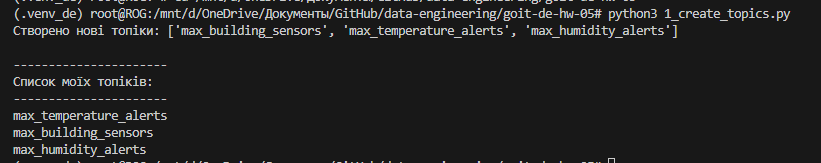
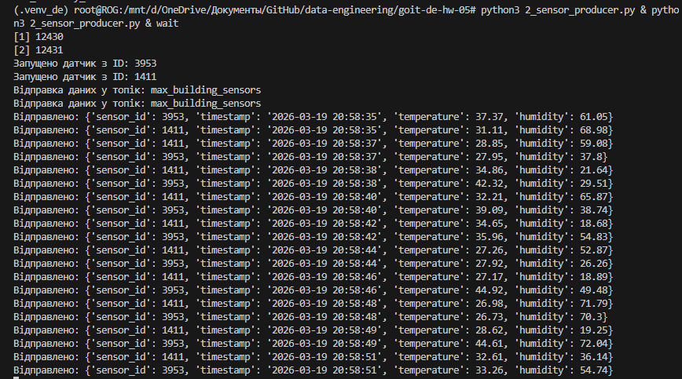
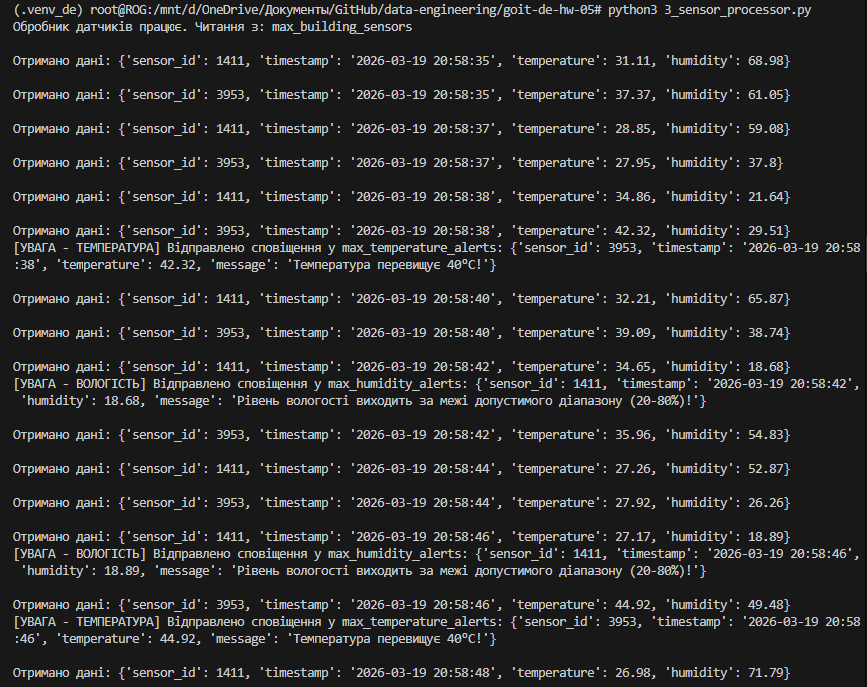
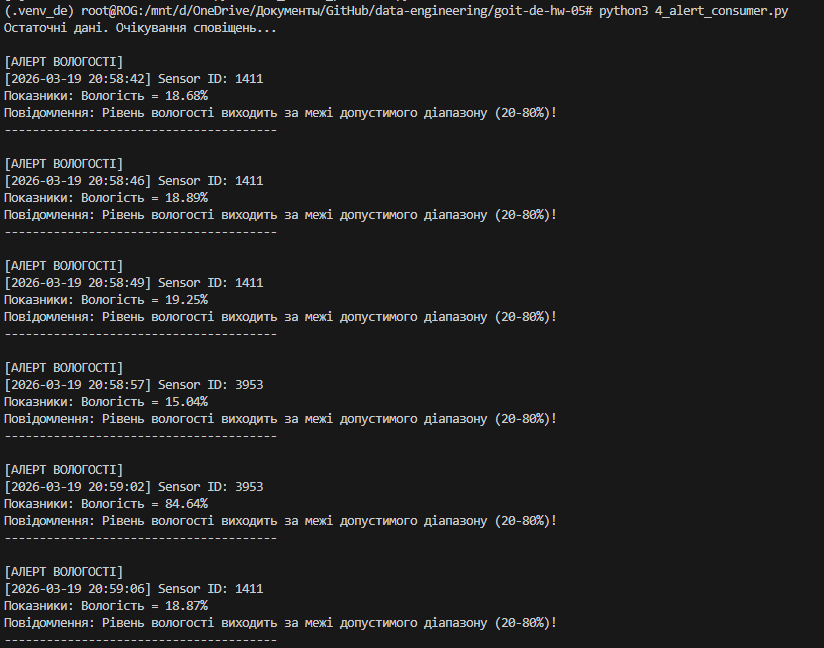

# Домашнє завдання 05: Apache Kafka

У каталозі `goit-de-hw-05` реалізовано пайплайн з 4 скриптів:

- `1_create_topics.py` створює 3 Kafka topics:
  - `*_building_sensors`
  - `*_temperature_alerts`
  - `*_humidity_alerts`
- `2_sensor_producer.py` імітує один датчик і кожні 2 секунди надсилає показники температури та вологості.
- `3_sensor_processor.py` читає `building_sensors` та формує алерти:
  - температура > 40°C
  - вологість > 80% або < 20%
- `4_alert_consumer.py` читає алерти з двох topics і виводить їх на екран.

Один запуск `2_sensor_producer.py` відповідає одному датчику.

## Підготовка середовища

1. Перейдіть у корінь репозиторію.
2. Встановіть залежності:

```bash
python3 -m pip install -r goit-de-hw-05/requirements.txt
```

3. За замовчуванням проєкт очікує локальний Kafka broker без авторизації:

```bash
KAFKA_BOOTSTRAP_SERVERS=127.0.0.1:9092
KAFKA_SECURITY_PROTOCOL=PLAINTEXT
KAFKA_TOPIC_PREFIX=max
```

У цьому випадку додатково нічого експортувати не потрібно, достатньо щоб broker був запущений локально.

4. Якщо потрібно, параметри Kafka можна перевизначити через змінні середовища.

Приклад для SASL_SSL:

```bash
export KAFKA_BOOTSTRAP_SERVERS="broker1:9092,broker2:9092"
export KAFKA_SECURITY_PROTOCOL="SASL_SSL"
export KAFKA_SASL_MECHANISM="PLAIN"
export KAFKA_USERNAME="your_username"
export KAFKA_PASSWORD="your_password"
export KAFKA_TOPIC_PREFIX="max"
```

Для локального Kafka без авторизації можна явно використати так:

```bash
export KAFKA_BOOTSTRAP_SERVERS="localhost:9092"
export KAFKA_SECURITY_PROTOCOL="PLAINTEXT"
export KAFKA_TOPIC_PREFIX="max"
```

## Локальний запуск Kafka broker

Перед запуском Python-скриптів потрібно окремо підняти локальний Kafka broker, інакше клієнти завершаться з помилкою `NoBrokersAvailable`.

### 1. Завантаження Kafka

```bash
mkdir -p /tmp/kafka-local-test
cd /tmp/kafka-local-test
wget -c -O kafka_2.13-3.8.0.tgz https://archive.apache.org/dist/kafka/3.8.0/kafka_2.13-3.8.0.tgz
tar -xzf kafka_2.13-3.8.0.tgz
```

### 2. Створення локального конфігураційного файлу

```bash
cat > /tmp/kafka-local-test/server-local.properties <<'EOF'
process.roles=broker,controller
node.id=1
controller.quorum.voters=1@127.0.0.1:9093
listeners=PLAINTEXT://127.0.0.1:9092,CONTROLLER://127.0.0.1:9093
advertised.listeners=PLAINTEXT://127.0.0.1:9092
listener.security.protocol.map=CONTROLLER:PLAINTEXT,PLAINTEXT:PLAINTEXT
controller.listener.names=CONTROLLER
inter.broker.listener.name=PLAINTEXT
log.dirs=/tmp/kafka-local-test/kraft-combined-logs
num.partitions=1
offsets.topic.replication.factor=1
transaction.state.log.replication.factor=1
transaction.state.log.min.isr=1
group.initial.rebalance.delay.ms=0
EOF
```

### 3. Ініціалізація storage для KRaft

```bash
rm -rf /tmp/kafka-local-test/kraft-combined-logs
CLUSTER_ID=$(/tmp/kafka-local-test/kafka_2.13-3.8.0/bin/kafka-storage.sh random-uuid)
/tmp/kafka-local-test/kafka_2.13-3.8.0/bin/kafka-storage.sh format -t "$CLUSTER_ID" -c /tmp/kafka-local-test/server-local.properties
```

### 4. Запуск Kafka broker

Запустіть broker в окремому терміналі:

```bash
/tmp/kafka-local-test/kafka_2.13-3.8.0/bin/kafka-server-start.sh /tmp/kafka-local-test/server-local.properties
```

### 5. Перевірка, що broker доступний

```bash
nc -zv 127.0.0.1 9092
```

Очікуваний результат:

```text
Connection to 127.0.0.1 9092 port [tcp/*] succeeded!
```

## Порядок запуску

Запускайте скрипти з кореня репозиторію в окремих терміналах.

1. Створення topics:

```bash
python3 goit-de-hw-05/1_create_topics.py
```

2. Запуск процесора:

```bash
python3 goit-de-hw-05/3_sensor_processor.py
```

3. Запуск читача алертів:

```bash
python3 goit-de-hw-05/4_alert_consumer.py
```

4. Запуск одного або кількох датчиків:

```bash
python3 goit-de-hw-05/2_sensor_producer.py
```

Для імітації кількох датчиків запустіть `2_sensor_producer.py` у кількох окремих процесах, або через команду:

```bash
python3 2_sensor_producer.py &
python3 2_sensor_producer.py &
wait
```

## Скріншоти виконання

Нижче додані готові скріншоти для кожного етапу завдання з коротким поясненням.

### 1. Створення трьох topics

Команда:

```bash
python3 goit-de-hw-05/1_create_topics.py
```

Скріншот демонструє наявність трьох topics з власним префіксом:



### 2. Генерація даних сенсорів та відправка в building_sensors

Команда:

```bash
python3 goit-de-hw-05/2_sensor_producer.py
python3 goit-de-hw-05/2_sensor_producer.py
```

Скріншот демонструє одночасну роботу двох запусків програми з різними `sensor_id`:



### 3. Отримання даних та фільтрація даних, що будуть використані далі

Команда:

```bash
python3 goit-de-hw-05/3_sensor_processor.py
```

Скріншот демонструє отримання повідомлень з `building_sensors` та перевірку умов фільтрації:



### 4. Демонстрація того, що відфільтровані дані були послані у відповідні topics

Команда:

```bash
python3 goit-de-hw-05/3_sensor_processor.py
```

Цей самий вивід процесора також показує, що відфільтровані дані були відправлені у `temperature_alerts` та `humidity_alerts`:


### 5. Результат запису відфільтрованих даних

Команда:

```bash
python3 goit-de-hw-05/4_alert_consumer.py
```

Скріншот демонструє фінальне зчитування алертів з `temperature_alerts` та `humidity_alerts`:



## Формат даних

Повідомлення датчика:

```json
{
  "sensor_id": 4821,
  "timestamp": "2026-03-19 20:30:00",
  "temperature": 41.37,
  "humidity": 18.42
}
```

Алерт температури:

```json
{
  "sensor_id": 4821,
  "timestamp": "2026-03-19 20:30:00",
  "temperature": 41.37,
  "message": "Температура перевищує 40°C!"
}
```

Алерт вологості:

```json
{
  "sensor_id": 4821,
  "timestamp": "2026-03-19 20:30:00",
  "humidity": 18.42,
  "message": "Рівень вологості виходить за межі допустимого діапазону (20-80%)!"
}
```
