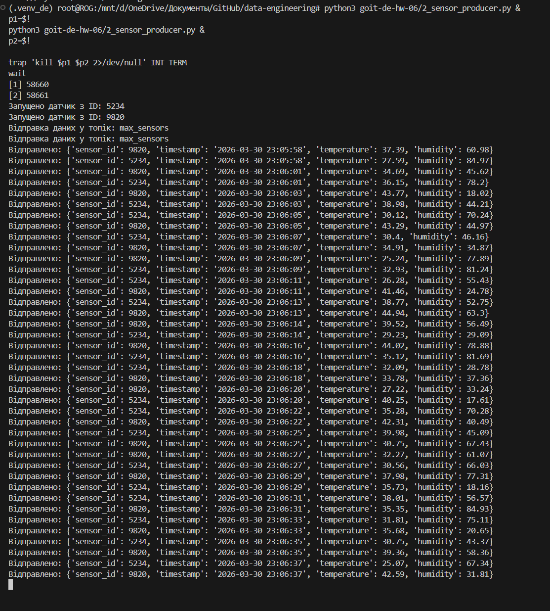
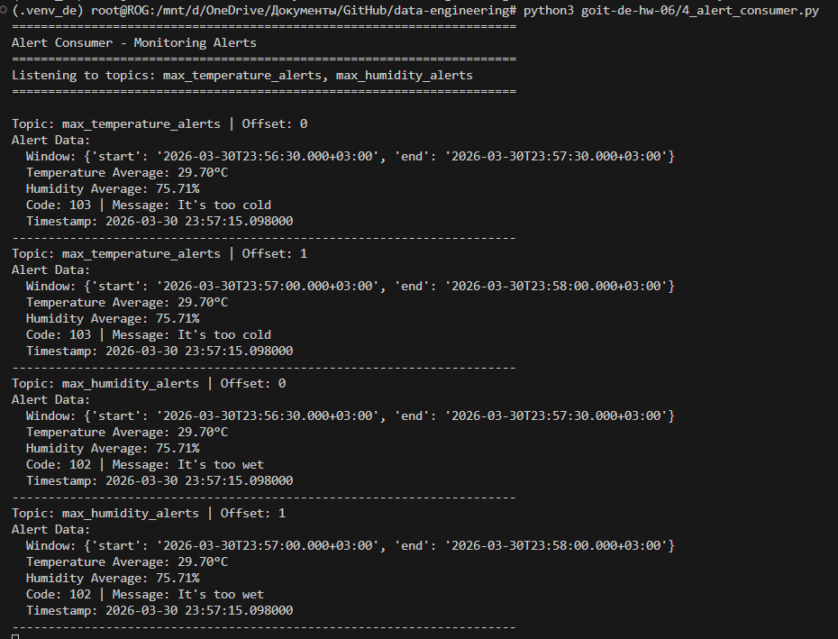

# Домашнє завдання 06: Apache Spark Streaming

У каталозі `goit-de-hw-06` реалізовано пайплайн з 4 скриптів:

- `1_create_topics.py` створює 3 Kafka topics:
  - `*_sensors` (вхідний потік, аналог `building_sensors`)
  - `*_temperature_alerts`
  - `*_humidity_alerts`
- `2_sensor_producer.py` імітує один датчик і кожні 2 секунди надсилає показники температури та вологості.
- `3_spark_streaming_alerts.py` читає потік із `*_sensors`, обчислює середні значення у sliding window та формує алерти за умовами з `data/alerts_conditions.csv`.
- `4_alert_consumer.py` читає алерти з двох topics і виводить їх на екран.

Один запуск `2_sensor_producer.py` відповідає одному датчику.

## Підготовка середовища

1. Перейдіть у корінь репозиторію.
2. Встановіть залежності:

```bash
python3 -m pip install -r goit-de-hw-06/requirements.txt
```

3. За замовчуванням проєкт очікує локальний Kafka broker без авторизації:

```bash
KAFKA_BOOTSTRAP_SERVERS=127.0.0.1:9092
KAFKA_SECURITY_PROTOCOL=PLAINTEXT
KAFKA_TOPIC_PREFIX=max
```

## Порядок запуску

Запускайте скрипти з кореня репозиторію в окремих терміналах.

1. Створення topics:

```bash
python3 goit-de-hw-06/1_create_topics.py
```

2. Запуск Spark streaming процесора:

```bash
python3 goit-de-hw-06/3_spark_streaming_alerts.py
```

3. Запуск читача алертів:

```bash
python3 goit-de-hw-06/4_alert_consumer.py
```

4. Запуск одного або кількох датчиків:

```bash
python3 goit-de-hw-06/2_sensor_producer.py
```

Для імітації кількох датчиків запустіть `2_sensor_producer.py` у кількох окремих процесах.

## Скріншоти виконання

### 1. Генерація даних сенсорів та відправка в building_sensors (аналог вхідного topic)

Команди:

```bash
python3 goit-de-hw-06/2_sensor_producer.py
python3 goit-de-hw-06/2_sensor_producer.py
```

Одночасна робота двох (або більше) запусків програми з різними `sensor_id` та відправкою у вхідний topic (`*_sensors`, аналог `building_sensors`):



### 2. Демонстрація того, що відфільтровані дані були послані у відповідні топіки

Команди:

```bash
python3 goit-de-hw-06/2_sensor_producer.py &
python3 goit-de-hw-06/2_sensor_producer.py
python3 goit-de-hw-06/3_spark_streaming_alerts.py
python3 goit-de-hw-06/4_alert_consumer.py
```

Відфільтровані дані після обробки потрапляють у `*_temperature_alerts` та `*_humidity_alerts`:

