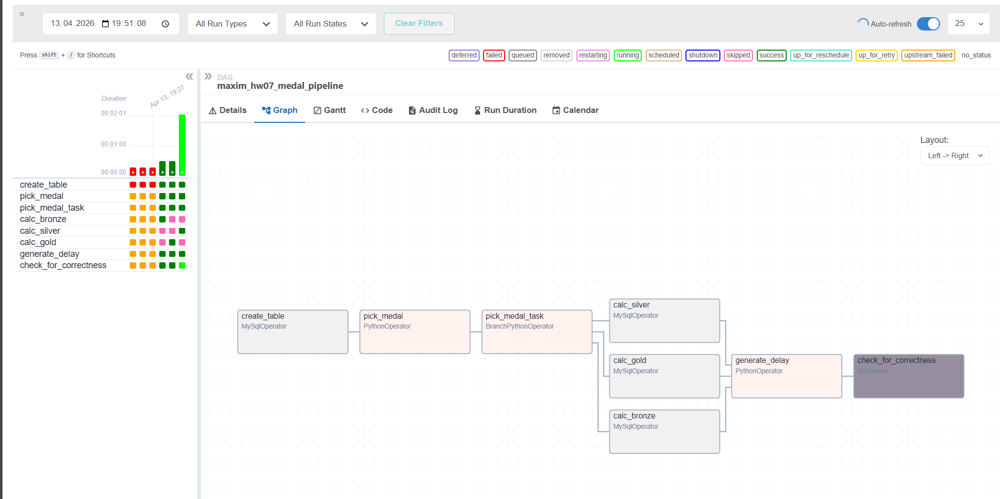
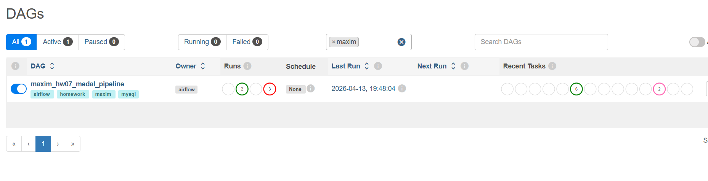
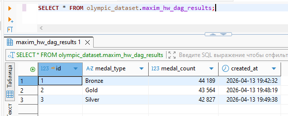
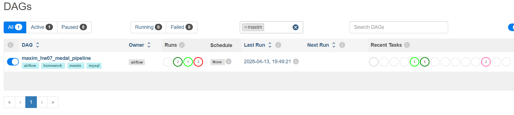

# Домашнє завдання 07: Apache Airflow

## Опис реалізації

У рамках завдання було розроблено DAG `maxim_hw07_medal_pipeline`, який виконує наступні етапи:
1. **Створення таблиці**: Задача `create_table` формує таблицю `olympic_dataset.maxim_hw_dag_results` (вставка `CREATE TABLE IF NOT EXISTS`) в базі даних MySQL.
2. **Випадковий вибір та розгалуження**: `pick_medal` генерує випадковий тип медалі (Bronze, Silver, Gold), а `pick_medal_task` (використовуючи `BranchPythonOperator`) направляє подальше виконання у відповідну гілку.
3. **Обчислення та збереження**: Задачі `calc_bronze`, `calc_silver` та `calc_gold` підраховують кількість відповідних медалей зі зведеної таблиці `athlete_event_results` і записують фінальний результат із timestamp у нашу таблицю.
4. **Штучна затримка**: Задача `generate_delay` зупиняє виконання на кількість секунд, передану через параметри конфігурації `delay_seconds`.
5. **Перевірка дати (Сенсор)**: `SqlSensor` (`check_for_correctness`) валідує останній доданий запис у таблиці результатів: якщо час його створення старший за 30 секунд від поточного моменту бази, сенсор продовжує очікування або падає по таймауту.

---

## Результати виконання

### 1. Структура DAG (Graph View)
На скріншоті показана структура пайплайну. Видно роботу `BranchPythonOperator`, який розгалужує потік на три незалежні таски (`calc_bronze`, `calc_silver`, `calc_gold`) для кожного типу медалей. Згодом потоки консолідуються у тасці `generate_delay`.

### 2. Успішне виконання (затримка 10 секунд)
При параметрі запуску `{"delay_seconds": 10}` час затримки становить менше 30 секунд. 

**Статус виконання в Airflow UI:**
Як видно на графіку, `BranchPythonOperator` успішно обрав лише одну гілку для виконання, а дві інші отримали статус `skipped` (світло-рожевий колір). Сенсор `check_for_correctness` успішно підтвердив "свіжість" даних, тому DAG закінчив роботу в статусі `success` (темно-зелений код кольору).

**Дані в таблиці MySQL:**
В базі можна побачити, що нові підраховані записи успішно додані. Зафіксовано тип медалі, її кількість і точний час `created_at` вставки у підсумкову таблицю.
На скріншоті нижче наведено результат SQL-запиту:

### 3. Відпрацювання сенсора з помилкою (затримка 35 секунд)
Для демонстрації "failed" роботи сенсора (згідно з умовою), DAG було запущено з конфігурацією параметра `{"delay_seconds": 35}`. 

**Фейл сенсора в Airflow UI:**
Штучна затримка перед сенсором (35 секунд) призвела до того, що під час ініціалізації SQL-перевірки запис у базі був вже "старим" (понад встановлений ліміт у 30 сек). Оскільки умова сенсора `TIMESTAMPDIFF <= 30` не виконалася, таска `check_for_correctness` відразу впала та отримала статус `failed` (червоний колір на графіку), що повністю підтверджує правильність реалізованої логіки.

